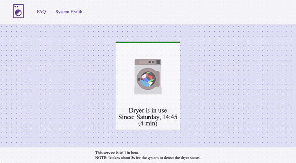

# 🧺 Dryer Monitoring System

<div align="center">
    
</div>


The Dryer Monitoring System is a real-time solution designed to monitor the operational status of a dryer using an ESP32 microcontroller, limit switches, and a web-based interface. This project provides users with instant updates and historical data logging, allowing them to track their dryer usage and optimize drying schedules for better efficiency.

## ✨ Features

- **Real-Time Monitoring**: Check the dryer's status (on/off) from any device connected to the same network.
- **Web-Based Interface**: A user-friendly dashboard displays the dryer's current status, system health, and historical logs.
- **Reliable Detection**: Uses limit switches to accurately detect when the dryer is off, avoiding false triggers caused by nearby washer vibrations.
- **Data Logging**: Logs dryer status changes with timestamps, enabling analysis of usage patterns.

## 📖 Background

Initially, the project used a vibration sensor to monitor the dryer’s operation. However, due to the washer being next to the dryer and causing strong vibrations, the vibration sensor sometimes produced false positives. To improve reliability, the system was switched to using limit switches, which accurately detect the dryer's status by engaging with a bump on the dryer dial.

## 🧩 Components

- **ESP32 Microcontroller**: Core processing unit that reads switch states and communicates with the server.
- **Limit Switches**: Three switches placed around the dryer dial to detect its 'off' position.
- **LED Indicator**: Provides visual feedback of the dryer's status and WiFi connectivity.
- **Node.js/Express Server**: Handles communication with the ESP32, serves the web interface, and logs dryer status data.

## 🛠️ Installation

### Hardware Setup

1. **Mount the Limit Switches**: Position three limit switches around the dryer dial at points where the bump on the dial will engage them, indicating the 'off' state.
2. **Connect the Switches to the ESP32**:
   - `switch1Pin` to `GPIO 14`
   - `switch2Pin` to `GPIO 27`
   - `switch3Pin` to `GPIO 33`
3. **Update the Wi-Fi Credentials**: Make sure you've got the right Wi-Fi credentials in the firmware of the ESP32


### Software Setup

1. **ESP32 Firmware**: Flash the ESP32 with the provided firmware using the Arduino IDE or another compatible environment. Ensure WiFi credentials and server URL are correctly set in the code.
2. **Server Setup**:
   - Install Node.js on a machine to act as the server.
   - Clone the repository and navigate to the server directory.
   - Run `npm install` to install necessary dependencies.
   - Configure the `.env` file with:
     ```
     PORT=6969
     FORMAT_DATE=true
     SYS_DOWN_TIME=10
     ```
   - Start the server with `npm start`.

### Accessing the Web Interface

1. Open a web browser on a device connected to the same network as the server.
2. Navigate to `http://<server-ip>:<port>/` to access the main dashboard.
3. Use the dashboard to monitor the dryer's status, check system health, and view historical logs.

## 🔄 How It Works

1. **Monitoring**: The ESP32 reads the state of the limit switches to determine the dryer's status. If any switch is engaged, the dryer is considered off.
2. **Communication**: The ESP32 sends the status to the server via HTTP POST requests. The server logs these updates and refreshes the web interface in real-time.
3. **System Health**: The server tracks the timing of updates. If no update is received within the `SYS_DOWN_TIME` threshold, the system is flagged as down.

## 🛠️ Troubleshooting

- **No Connection to WiFi**: Verify that the SSID and password are correctly entered in the firmware. Check the network signal strength.
- **Incorrect Dryer Status**: Ensure that limit switches are properly placed and wired. Check for loose connections.
- **Server Not Responding**: Confirm that the server is running and listening on the correct port. Check for errors in the server console.

---
## Note on Repository Contents ⚠️

This is the public version of the Dryer Monitoring System repository. It includes all the essential code and documentation needed to understand and use the system. Rest assured, this repository is fully functional, and all the code provided works as intended. You should be able to run the system smoothly using the provided instructions in the [documentation](repo/documentation/ReM%20Technical%20Design%20Documentation.pdf).

For security and privacy reasons, sensitive data, development configurations, and detailed commit history have been removed. This public repository was cloned from the private version and sanitized to exclude any sensitive information. The private repository, which contains the full commit history and sensitive details, is restricted to authorized personnel only.

If you need access to the complete repository that includes sensitive data, past commit history, and development configurations, please contact me. Access will be granted based on necessity and authorization.

